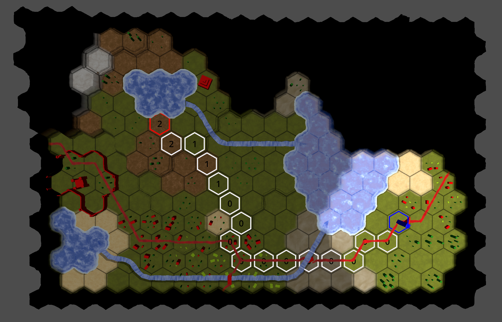

# hex_map_godot

I created this repository as a learning exercise. I re-created the hex map tutorials from "catlikecoding", but in Godot rather than in Unity.

The original tutorials by "catlikecoding" are at the following link: https://catlikecoding.com/unity/tutorials/hex-map/

As I was working through the tutorials, I was often faced with decisions. Some were simply due to the differences between Unity and Godot. Other decisions were due to coding style, preferences, or design decisions.

For the most part, I tried to stay true to how "catlikecoding" designed his hex map. Therefore, to the extent that is possible, you will find that class names, function names, variable names, etc. match those of the tutorials. There are some exceptions. I chose to use `snake_case` because that seems to be the Godot standard (and I really like `snake_case`), whereas the original tutorials for Unity primarily use `camelCase`.

Although Godot does support C#, I chose to use GDScript since this was an exercise in learning Godot. The Godot editor doesn't really have any autocomplete features for C#, so that also pushed me towards using GDScript.

I have completed all 27 of the original tutorials. With the exception of some minor differences and/or bugs, you will find that the feature set closely matches those of catlikecoding's original hex map project. I have not completed his "new" tutorials which are found at the following link: https://catlikecoding.com/unity/hex-map/ . The "new" tutorials are primarily quality-of-life updates to his original codebase, and so I decided to pass on those.

## Screenshots

Here are some screenshots to give you an idea of the kind of hex maps that you can make using this tool.

Screenshot 1: Shows a hex map with terrain, roads, buildings, trees, and farmland. There are also lakes and rivers.

Screenshot 2: Shows this same hex map, but in "play mode". There is functional pathfinding, explored/unexplore territory, and fog-of-war.

Screenshot 3: This is a randomly generated map

Screenshot 4: This is the same randomly generated map, but zoomed in to show some features of the map close-up.

